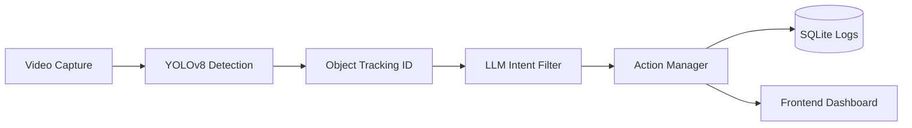

# 🛡️ Smart CCTV System: Project Blueprint & Technical Overview

This document provides a comprehensive breakdown of the **Smart CCTV System**, its architecture, tech stack, and core logic intended for building a high-performance frontend and a robust backend.

---

## 🏗️ 1. Project Concept
The Smart CCTV System is an AI-driven surveillance platform that merges **Computer Vision (CV)** with **Natural Language Processing (NLP)**. Unlike traditional systems that merely record, this system "understands" what it sees and allows users to interact with the video feed using plain English.

---

## 💻 2. Tech Stack

### Backend (The "Engine")
- **Python 3.8+**: Core application logic.
- **OpenCV**: Frame capture, image processing, and visual feedback.
- **Ultralytics (YOLOv8)**: Real-time object detection (optimized for speed and accuracy).
- **Supervision**: Advanced tracking logic to ensure object ID persistence across frames.
- **SQLite3**: Lightweight, file-based relational database for logging and configuration.

### AI & Reasoning (The "Brain")
- **Groq API (Llama 3.3)**: High-speed LLM processing for intent recognition.
- **LangChain/Python-Dotenv**: Manages the AI orchestration and secure API credentials.

---

## 🛠️ 3. Core Components & Logic

### A. Intent Parsing (`llm_parser.py`)
This component converts unstructured human language into a structured JSON "Intent."

**Code Showcase:**
```python
class LLMParser:
    def parse(self, query):
        # Prompt guides the LLM to return only JSON
        prompt = f"Convert CCTV query into structured JSON string: {query}"
        
        # Uses Llama-3-70B for high-precision logic
        response = self.client.chat.completions.create(
            model="llama-3.3-70b-versatile",
            messages=[{"role": "user", "content": prompt}]
        )
        return json.loads(content)
```

### B. Robust Database Layer (`db.py`)
To handle high-speed video frames (30+ FPS), the database logic uses **timeouts** and **exception handling** to prevent locks.

**Code Showcase:**
```python
def log_entry(track_id):
    # 'timeout=30' handles concurrent access during high-volume detections
    with sqlite3.connect(DB_NAME, timeout=30) as conn:
        cursor = conn.cursor()
        cursor.execute("INSERT INTO person_logs (track_id, entry_time) VALUES (?, ?)", 
                       (track_id, datetime.now().isoformat()))
```

### C. Zone & Intrusion Management (`zone_manager.py`)
Maintains "Restricted Polygons" and triggers alerts when an object's center coordinates intersect with the defined zones.

---

## 🧬 4. Workflow Diagram


---

## 🎨 5. Frontend Implementation Strategy (The "Next Step")

To project maps perfectly to **Track 2 (Web/Systems Interaction)**. Here is how you should build the frontend:

### Recommended Tech:
- **Framework**: Next.js (React) + Tailwind CSS.
- **UI Library**: shadcn/ui (for a premium, dark-mode "Defense Tech" aesthetic).
- **Real-time**: Socket.io or WebSockets to push "Intrusion" events from the DB to the UI instantly.

### Feature Suggestions:
1.  **Live Grid**: A dashboard showing the live processed feed.
2.  **Intent Bar**: A natural language input field where users "talk" to their cameras.
3.  **Heatmaps**: A visual representation of where most movement occurred throughout the day (using `db.py` data).
4.  **Interactive Zones**: A tool where users can click and drag on the live feed to draw and save new restricted zones to `cctv.db`.

---

## 📊 6. Database Schema Summary
- **`person_logs`**: Tracks ID, Entry Time, Exit Time, and Duration.
- **`zones`**: Stores coordinates (x1, y1, x2, y2) and camera metadata.
- **`intrusion_logs`**: Records specific violations of restricted areas with video timestamps.
